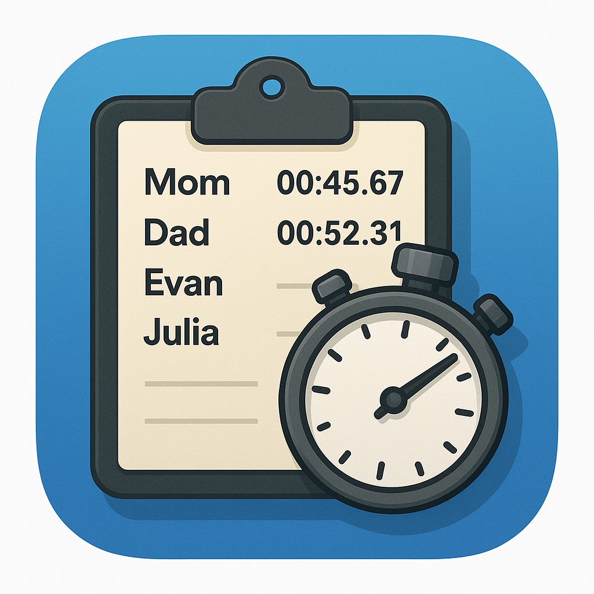

# Multi-Player Competition Timer

  

A web-based timer application designed for tracking multiple competitors in games, races, or other competitive events. Perfect for game nights, competitions, or any scenario where you need to time multiple participants.

## Features

- **Two Timer Modes:**
  - **Together Mode**: All participants start together, and you record finish times as each person completes
  - **Single Mode**: Time each participant individually, one at a time

- **Three Timer Types:**
  - **Stopwatch**: Count up from zero
  - **Countdown**: Count down from a set duration
  - **Countdown with Points**: Count down while tracking points for each participant (click participants to add points)

- **Participant Management**: Add, remove, and track unlimited participants

- **Scoreboard System**: 
  - Track cumulative scores across multiple competitions
  - Visual bar graph representation of scores
  - Persistent storage of scores in local browser storage
  - Add scores based on competition placement or countdown-points mode
  - Adjust scores with plus/minus buttons
  - Animated score changes and position updates
  - Reset scores with confirmation prompt

  

- **Large Display**: Optimized for viewing on TVs and large screens with high-contrast design

- **Responsive Layout**: 
  - Portrait mode for mobile devices
  - Landscape mode optimized for TVs and horizontal displays
  - Mode toggles positioned next to participants section in landscape for easy access

- **Wake Lock Support**: Prevents screen from sleeping during active timing

- **Persistent Storage**: Participant list is saved locally in your browser

## How to Use

### Getting Started

1. **Add Participants**: 
   - Enter names in the "Participants" section
   - Press "Add Participant" or hit Enter
   - Remove participants by clicking the × button next to their name

2. **Choose a Timer Mode**:
   - **Together Mode**: For races or competitions where everyone starts simultaneously
   - **Single Mode**: For turn-based timing where each participant goes individually

3. **Choose a Timer Type**:
   - **Stopwatch**: For timing how long something takes
   - **Countdown**: For time-limited challenges
   - **Countdown with Points**: For scoring games where you click participants to award points during a countdown

### Together Mode

1. Add all participants first
2. Click "Start" (or tap the timer display) when the competition begins
3. Click "Stop" (or tap the timer display) each time a participant finishes
4. After all times are recorded, assign each time to the correct participant using the dropdown menus
5. Times are automatically sorted to show fastest times first after assignment

### Single Mode

1. Add all participants first
2. Select the first participant from the dropdown menu
3. Click "Start" when they begin
4. Click "Stop" when they finish - the time is automatically assigned
5. The next participant is automatically selected for you
6. Repeat until all participants have completed

### Countdown with Points Mode

Perfect for scoring games, trivia competitions, or any activity where you want to track points during a timed round.

**Together Mode:**
1. Add all participants first
2. Select "Countdown with Points" timer type
3. Set the countdown duration (in seconds)
4. Click "Start" to begin the countdown
5. Click on any participant's name to add a point (plays a beep sound)
6. When time expires, participants are automatically ranked by:
   - Most points first
   - If tied, whoever got their last point earliest wins
7. Position badges (1st, 2nd, 3rd) are displayed with final scores

**Single Mode:**
1. Add all participants first
2. Select "Countdown with Points" timer type
3. Choose a participant from the dropdown
4. Set the countdown duration (in seconds)
5. Click "Start" to begin - the selected participant appears at the top highlighted in green
6. Click on the participant's name to add points (plays a beep sound)
7. When time expires, final score is displayed
8. Results are ranked across all participants who have completed

### Controls

- **Start Button**: Begin timing
- **Stop Button**: Record the current time (in Stopwatch/Countdown modes) or finish timing the current participant (in Single Mode). Not used in Countdown with Points mode.
- **Reset Button**: Clear all recorded times/points and reset the timer
- **Scoreboard Button**: View the persistent scoreboard with cumulative scores
- **Timer Display**: Click/tap the timer display to start or stop (same as the buttons, except in Countdown with Points mode)
- **Participant Names**: In Countdown with Points mode, click participant names to add points (with beep sound)

### Scoreboard

The scoreboard tracks cumulative points across multiple competitions:

1. **Viewing the Scoreboard**: Click the "Scoreboard" button (blue button on the right) to view current standings
2. **Adding Scores After Competition**: 
   - When all participants have been timed, buttons appear to add scores to the scoreboard
   - "Add Places to Scoreboard" - Awards points based on finishing position (1st place gets the most points)
   - "Add Points to Scoreboard" - Awards points based on the points earned in Countdown with Points mode
3. **Adjusting Scores**: Use the plus/minus buttons next to each participant in the preview modal to apply bonuses or deductions before confirming
4. **Managing Scores**: 
   - Scores are automatically saved to browser local storage
   - Use plus/minus buttons in the scoreboard modal to manually adjust scores
   - Click "Reset Scores" to clear all scores (requires confirmation)
5. **Visual Features**:
   - Bar graphs show relative scores
   - Animated score changes and position movements
   - Gold, silver, and bronze styling for top 3 positions

## Landscape/TV Optimization

When viewed in landscape orientation on screens 768px or wider:
- Mode toggles appear next to the Participants section for easy access
- Timer display is larger (66% of width) for better visibility
- Recorded times column is narrower (33% of width) but with larger font sizes
- Layout maximizes space efficiency for viewing from a distance

## Technical Details

- Pure HTML/CSS/JavaScript - no build process required
- Uses localStorage to persist participant data and scoreboard scores
- Supports Web Wake Lock API to prevent screen dimming during active timing
- Web Audio API for beep sounds when adding points
- Progressive Web App (PWA) ready with manifest and icons

## Installation

Simply open `index.html` in any modern web browser. For best results:
- Use a modern browser (Chrome, Firefox, Safari, Edge)
- Allow wake lock permissions for uninterrupted timing
- Add to home screen on mobile devices for full-screen experience

## License

See LICENSE file for details.
